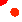
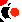
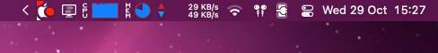
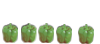
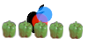
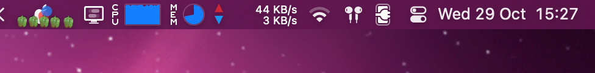
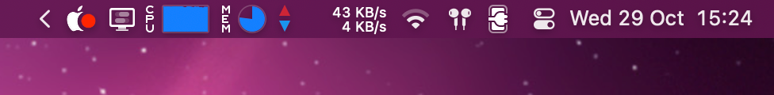
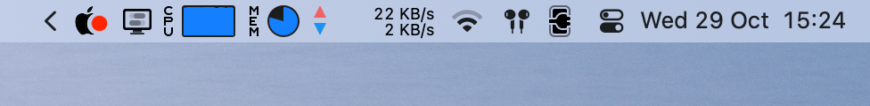

# Electron macOS Layered Tray Icons - Proof of Concept

Demo of my idea/feature for Electron's layered tray icons API for macOS. The cool part is you can compose multi-layer icons where some layers adapt to the menubar theme (template images) while others keep their color.

## Core Concept

The main idea is **composing icons with mixed rendering modes**:

- **Template layers**: Monochrome images that automagically adapt to the menubar theme (light/dark)
- **Color layers**: Fixed-color overlays that stay the same regardless of theme (like notification dots)

So you can have an apple icon that changes with the menubar, but a red notification dot that stays red.

## Three Demo Modes

### Mode 1: Apple with Indicator

Basic use case - a template icon with a colored indicator overlay.

| Icon Asset | Type | Description |
|------------|------|-------------|
|  | Template | Base apple icon that adapts to menubar theme |
|  | Color | Red notification indicator that stays red |

**Result:**

The apple shape changes color based on the menubar theme, while the red dot keeps its color.

---

### Mode 2: Apple with Indicator (1x vs 2x Representations)

Handling different pixel densities with separate 1x and 2x image representations.

| Resolution | Icon Asset | Type | Description |
|------------|------------|------|-------------|
| **1x** |  | Template | Base apple for standard displays (has extra black corner for demo differentiation) |
| **1x** |  | Color | Red indicator for standard displays (has extra red corner for demo differentiation) |
| **2x** |  | Template | Base apple for retina displays |
| **2x** |  | Color | Red indicator for retina displays |

> **Demo Differentiation**: The 1x versions have extra colored corners (red on template, black on indicator) so you can easily tell which representation is being used.

**Result:**

| 1x Representation | 2x Representation |
|-------------------|-------------------|
|  | Same concept, crisp on retina |

**Preview in Action:**

*Screenshot from a display forced to non-retina mode via [BetterDisplay](https://github.com/waydabber/BetterDisplay), showing the 1x representation with the corner markers.*

---

### Mode 3: Apple Complex (5-Layer Composition)

Going complex with **5 layers** - mix of template and color elements.

| Layer | Icon Asset | Type | Description |
|-------|------------|------|-------------|
| 1 |  | Template | Main apple body |
| 2 |  | Template | Apple leaf |
| 3 |  | Color | Red status indicator (50% alpha) |
| 4 |  | Color | Blue status indicator (50% alpha) |
| 5 |  | Color | Additional color overlay (44x100px - intentionally oversized for demo) |

**Result:**

**Preview in Action:**

**Video Demonstration:**

<video src="https://github.com/user-attachments/assets/49f78392-618a-4978-a5af-623f6f157b6e" controls></video>

*The video shows the progressive layer composition, including:*

- How layers stack and compose together
- Multiple template images working in harmony
- Opacity handling across different layer types
- **Different layer sizes**: The bellpeppers layer is 44x100px while other layers are 44x44px - all layers get centered to the largest canvas

**Note on Different-Sized Layers**: The API handles layers of different dimensions through defensive programming (automatically centering smaller layers on the larger canvas). This is not an intended feature to rely on, just a safety mechanism. The bellpeppers example (44x100px) demonstrates this defensive behavior when mixed with standard 44x44px layers.

## Theme Adaptation

How it looks across different menubar themes:

### Dark Menubar

Template layers (apple shape) render in light colors for visibility on dark backgrounds, while colored layers (red/blue dots) keep their colors.

### Light Menubar

Template layers (apple shape) render in dark colors for visibility on light backgrounds, while colored layers (red/blue dots) stay the same.
